# 🏗️ MAINTAIN AI — Predictive Infrastructure Command Center

> **Microsoft AI Dev Days Hackathon — Build AI Applications & Agents using Microsoft AI Platform**

[](https://github.com/your-username/ReasoningAgent/actions/workflows/ci.yml)


A multi-agent reasoning system that helps Lake Forest, IL city planners intelligently prioritize, schedule, and optimize infrastructure repairs using AI-powered analysis, predictive crew estimation, and an immersive futuristic interface. Built on **Azure AI Foundry** (5 models via Model Router), **Semantic Kernel** (8 plugins), **7 orchestrator pipelines** (including parallel execution & dynamic negotiation), **A2A agent protocol**, **RAG pipeline**, MCP toolchains, Dataverse, OpenTelemetry, and Azure Content Safety.

---

## 🎯 Demo Script

> *"It's 6 AM. Before any human opens the app, our AI has already analyzed overnight weather data, historical failure patterns, and crew positions. It's prepared three proactive recommendations — and it can show you exactly why it made each one. Let me show you how we're not just reacting to infrastructure failures... we're preventing them."*

---

## ✨ Key Features

### 🤖 Multi-Agent Reasoning System (6 Agents, 7 Pipelines)
- **Analysis Agent** — Synthesizes infrastructure state from 1,281+ work orders (GPT-4.1)
- **Prioritization Agent** — Multi-factor scoring with explainable AI reasoning (GPT-4.1-mini)
- **Crew Estimation Agent** — Predictive crew allocation based on historical metrics, weather, and severity (Phi-4)
- **Dispatch Agent** — LLM-enhanced crew dispatch optimization (GPT-4.1-mini)
- **Report Generator Agent** — AI-powered infrastructure reports with Code Interpreter-generated matplotlib charts (GPT-4.1)
- **NLP Dashboard Agent** — Natural language → dashboard builder with Code Interpreter (GPT-4o)

### 🔀 Agent Orchestrator (7 Pipelines)
- **full_assessment** — Sequential end-to-end analysis → prioritization → crew estimation
- **full_assessment_parallel** — Parallel execution of analysis + prioritization, then crew estimation
- **triage** — Quick analysis + prioritization only
- **deploy_crews** — Analysis → prioritization → crew estimation → dispatch
- **investigate** — Deep-dive analysis of specific work orders
- **feedback_loop** — Iterative refinement with agent re-evaluation
- **dynamic_negotiation** — Multi-agent negotiation for resource-constrained scenarios

### 🧠 Model Router & Multi-Model Strategy
- **5 Azure AI Foundry models**: GPT-4.1, GPT-4.1-mini, GPT-4o, Phi-4, Phi-4-reasoning
- **3 tiers**: Premier (complex analysis), Standard (balanced), Lightweight (high-volume/cost-sensitive)
- **Automatic routing**: Each agent is mapped to its optimal model based on task complexity
- **Automatic fallback**: If routed model fails, falls back to GPT-4.1-mini
- **Single SDK**: `azure-ai-inference` (ChatCompletionsClient) — proper Foundry SDK

### 📚 RAG Pipeline (Retrieval-Augmented Generation)
- **10 curated knowledge documents**: Municipal codes, APWA repair standards, safety regulations, ADA compliance, weather impact, budget guidelines, crew management best practices
- **Foundry Embeddings**: `text-embedding-3-small` (1536 dimensions) via `azure-ai-inference` EmbeddingsClient
- **Dense vector cosine similarity** retrieval with configurable top-k
- **Automatic TF-IDF fallback** if embedding service is unavailable
- **Interactive query interface** in the Model Router panel

### 🗺️ Immersive Leaflet Map
- Animated pulsing markers (priority-coded)
- Predictive heatmap overlays
- Real-time crew location tracking
- Glassmorphism floating panels

### 🧠 AI Transparency
- Reasoning steps panel showing "why" behind decisions
- Confidence scores for every recommendation
- Decision factor breakdowns

### 🔮 What-If Scenario Simulator
- Timeline scrubber for predictive modeling
- Weather impact simulation
- Crew pre-positioning recommendations

### ⚡ Proactive AI Notifications
- Ambient alerts surfaced before users ask
- Weather-triggered surge predictions
- School proximity priority boosts

---

## 🔬 Microsoft AI Platform Technologies

| Technology | Usage | Evidence |
|-----------|-------|---------|
| **Azure AI Foundry** | 5 deployed models via Model Router | `model_router.py` — ChatCompletionsClient |
| **Model Router** | Tier-based routing (Premier/Standard/Lightweight) | 9 agent routes, automatic fallback |
| **RAG Pipeline** | Foundry text-embedding-3-small (1536d) + cosine retrieval | `rag_knowledge_base.py` |
| **Semantic Kernel** | v1.39, 8 plugins (Weather, Priority, Analysis, etc.) | `sk_kernel.py` with Foundry fallback |
| **Azure Content Safety** | 4-category screening (Hate, Violence, Self-Harm, Sexual) | `contentSafety.py` |
| **OpenTelemetry** | Distributed tracing with App Insights export | `@traced` decorators, AgentTraceViewer |
| **MCP Protocol** | 10-tool MCP server (JSON-RPC 2.0) on Azure Container Apps | `mcpService.ts` |
| **Power Apps** | Code Apps deployment via `pac code push` | `power.config.json` |
| **Dataverse** | 6-table data persistence (work orders, crews, dispatches) | `dataverseCrudService.py` |
| **Azure Container Apps** | Agent API hosting + MCP server hosting | `deploy-aca.ps1` |

---

## 🏗️ Architecture

<details>
<summary>ASCII Architecture Diagram</summary>

```
┌─────────────────────────────────────────────────────────────────┐
│                    MAINTAIN AI ARCHITECTURE                      │
├─────────────────────────────────────────────────────────────────┤
│                                                                 │
│   ┌──────────────┐    ┌──────────────┐    ┌──────────────┐     │
│   │   Analysis   │───▶│Prioritization│───▶│    Crew      │     │
│   │  (GPT-4.1)   │    │ Hybrid:      │    │ Hybrid:      │     │
│   │              │    │ Formula +    │    │ Formula +    │     │
│   │              │    │ GPT-4.1-mini │    │ Phi-4 LLM    │     │
│   └──────────────┘    └──────────────┘    └──────────────┘     │
│          │                   │                   │              │
│   ┌──────────────┐    ┌──────────────┐    ┌──────────────┐     │
│   │   Dispatch   │    │    Report    │    │NLP Dashboard │     │
│   │(GPT-4.1-mini)│    │  (GPT-4.1)  │    │  (GPT-4o)    │     │
│   └──────────────┘    └──────────────┘    └──────────────┘     │
│          │                   │                   │              │
│          └───────────────────┴───────────────────┘              │
│                              │                                  │
│                              ▼                                  │
│   ┌──────────────────────────────────────────────────────────┐  │
│   │              MODEL ROUTER (azure-ai-inference)            │  │
│   │  GPT-4.1 │ GPT-4.1-mini │ GPT-4o │ Phi-4 │ Phi-4-reason │  │
│   │  Premier  │   Standard   │ Premier│ Lite  │   Standard   │  │
│   └──────────────────────────────────────────────────────────┘  │
│                              │                                  │
│          ┌───────────────────┼───────────────────┐              │
│          ▼                   ▼                   ▼              │
│   ┌──────────────┐    ┌──────────────┐    ┌──────────────┐     │
│   │Semantic Kernel│   │  RAG Pipeline │    │ Content Safety│    │
│   │  8 Plugins   │    │ 10 Knowledge │    │  4-Category  │     │
│   └──────────────┘    └──────────────┘    └──────────────┘     │
│                              │                                  │
│          ┌───────────────────┼───────────────────┐              │
│          ▼                   ▼                   ▼              │
│   ┌──────────────┐    ┌──────────────┐    ┌──────────────┐     │
│   │ MCP Server   │    │  Dataverse   │    │ OpenTelemetry│     │
│   │ (10 tools)   │    │ (6 tables)   │    │ + App Insights│    │
│   └──────────────┘    └──────────────┘    └──────────────┘     │
│                              │                                  │
│                              ▼                                  │
│   ┌─────────────────────────────────────────────────────────┐  │
│   │             POWER APPS CODE APPS UI                      │  │
│   │  ┌──────────────────┐  ┌───────────────────────────┐ │  │
│   │  │ Dashboard (1.2K) │  │ OverlayManager (304)    │ │  │
│   │  │ Map + Cards +    │  │ 16 overlay panels       │ │  │
│   │  │ AnalyticsWidgets │  │ extracted from Dash     │ │  │
│   │  └──────────────────┘  └───────────────────────────┘ │  │
│   │  ┌──────────────────┐  ┌───────────────────────────┐ │  │
│   │  │ SeverityEngine  │  │ Model Router & RAG Panel│ │  │
│   │  │ APWA Standards  │  │ Crew / Dispatch / NLP   │ │  │
│   │  └──────────────────┘  └───────────────────────────┘ │  │
│   └─────────────────────────────────────────────────────────┘  │
└─────────────────────────────────────────────────────────────────┘
```

</details>

---

## 🛠️ Tech Stack

| Layer | Technology |
|-------|------------|
| **AI Models** | Azure AI Foundry — GPT-4.1, GPT-4.1-mini, GPT-4o, Phi-4, Phi-4-reasoning |
| **Model Router** | Custom multi-model router with tier-based routing + automatic fallback |
| **RAG Pipeline** | Foundry `text-embedding-3-small` embeddings (1536d) + dense cosine retrieval, TF-IDF fallback |
| **AI Orchestration** | Semantic Kernel v1.39 (8 plugins) + `azure-ai-inference` SDK |
| **AI Severity Engine** | APWA-standard NLP + proximity + decay scoring (`severityEngine.ts`) |
| **Agent Orchestrator** | 7 pipelines (sequential, parallel, triage, deploy, investigate, feedback loop, negotiation) |
| **AI Agents** | 6 Python agents via FastAPI (Analysis, Prioritization, Crew, Dispatch, Report, NLP Dashboard) |
| **A2A Protocol** | Agent-to-Agent communication with structured handoffs and trace attribution |
| **MCP Server** | MAINTAIN AI MCP (Azure Container Apps) — 10 tools |
| **AI Safety** | Azure Content Safety (4-category screening) |
| **Observability** | OpenTelemetry + Azure Application Insights (distributed tracing) |
| **Frontend** | Power Apps Code Apps + React 18 + TypeScript |
| **UI Framework** | Fluent UI v9 + Glassmorphism |
| **Map** | Leaflet + React-Leaflet |
| **Animations** | Motion (Framer Motion) |
| **Data** | Dataverse (Power Platform) — 6 tables |
| **Hosting** | Power Platform + Azure Container Apps |

---

## 📁 Project Structure

```
ReasoningAgent/
├── .github/
│   ├── workflows/ci.yml               # GitHub Actions CI (pytest + npm build)
│   └── copilot-instructions.md       # Copilot operating rules
├── agents/                            # Python agent backend (FastAPI on ACA)
│   ├── api_server.py                  # FastAPI server (1,640+ lines, 25+ endpoints)
│   ├── model_router.py               # Multi-model router (5 Foundry models, 3 tiers)
│   ├── rag_knowledge_base.py          # RAG pipeline (11 knowledge docs, Foundry embeddings)
│   ├── analysisAgent.py               # Infrastructure analysis agent (GPT-4.1)
│   ├── prioritizationAgent.py         # Hybrid priority scoring (formula + GPT-4.1-mini LLM reasoning)
│   ├── crewEstimationAgent.py         # Hybrid crew allocation (formula + Phi-4 LLM reasoning)
│   ├── dispatchAgent.py               # Crew dispatch optimization agent (GPT-4.1-mini)
│   ├── reportAgent.py                 # AI report generation w/ matplotlib charts (GPT-4.1)
│   ├── nlpDashboardAgent.py           # NL → dashboard agent (GPT-4o + Code Interpreter)
│   ├── sk_kernel.py                   # Semantic Kernel v1.39 (8 plugins, Foundry fallback)
│   ├── contentSafety.py               # Azure Content Safety guardrails
│   ├── dataverseCrudService.py        # Dataverse CRUD operations
│   ├── tableStorageService.py         # Azure Table Storage fallback
│   ├── run_agents.py                  # Agent runner/orchestrator
│   ├── deploy-aca.ps1                 # Azure Container Apps deployment script
│   ├── Dockerfile                     # Python 3.12-slim container
│   ├── requirements.txt              # 18 packages
│   └── tests/                         # 9 test files, 252 tests (pytest)
├── dataverse/
│   ├── table-schemas.json             # 6-table Dataverse schema definitions
│   └── provision-tables.ps1           # Table provisioning script
├── docs/
│   ├── PLAN.md                        # Implementation roadmap (all phases complete)
│   ├── CHANGELOG.md                   # Version history
│   ├── ERROR_LOG.md                   # Error tracking (ERR-001 – ERR-009)
│   ├── DECISIONS.md                   # Architecture Decision Records
│   ├── AGENT_WORK_LOG.md              # Multi-agent session tracking
│   └── PRESENTATION_FRAMEWORK.md     # Demo narrative guide
├── src/
│   ├── components/                    # 38 React components
│   │   ├── map/                       # 7 map implementations (Leaflet, Canvas, SVG, etc.)
│   │   ├── ui/                        # 12 shadcn/ui primitives
│   │   ├── ModelRouterPanel.tsx       # Model Router & RAG visualization panel
│   │   ├── OverlayManager.tsx         # Extracted: renders 16 overlay/modal panels
│   │   ├── AnalyticsWidgets.tsx        # Extracted: 4-widget analytics grid
│   │   ├── AgentTraceViewer.tsx       # Observability overlay (traces + telemetry)
│   │   ├── ResponsibleAIPanel.tsx     # 3-tab RAI governance panel
│   │   ├── SemanticKernelPanel.tsx    # SK orchestrator + plugin invocation
│   │   ├── AICompanionPanel.tsx       # AI reasoning + proactive notifications
│   │   ├── CrewDashboard.tsx          # Crew capacity visualization
│   │   ├── ScenarioSimulator.tsx      # What-If timeline simulator
│   │   ├── MaintainIntro.tsx          # 1,540-line animated brain intro
│   │   ├── HelpPanel.tsx             # Feature guide hub (669 lines)
│   │   └── ...                        # 19 more feature components
│   ├── services/                      # 14 service modules
│   │   ├── agentService.ts            # Agent API communication
│   │   ├── mcpService.ts             # MCP with probe + CORS fallback
│   │   ├── dataverseService.ts        # 6-table CRUD with field mapping
│   │   └── ...                        # 11 more services
│   ├── utils/
│   │   └── severityEngine.ts          # AI Severity Assessment Engine (APWA standards)
│   ├── pages/
│   │   └── Dashboard.tsx             # Main page (~1,160 lines, modular architecture)
│   ├── types/
│   │   └── infrastructure.ts         # 30+ TypeScript interfaces
│   └── generated/                     # Power SDK auto-generated models/services
├── .env.example                       # All env vars documented (15+)
├── package.json
├── tailwind.config.js
├── tsconfig.json
└── README.md
```

---

## 🚀 Quick Start

The fastest way to get MAINTAIN AI running locally — frontend + AI agent backend.

### Prerequisites

| Tool | Version | Install |
|------|---------|---------|
| **Node.js** | 18+ | [nodejs.org](https://nodejs.org) |
| **Python** | 3.10+ | [python.org](https://www.python.org) |
| **Git** | any | [git-scm.com](https://git-scm.com) |

> **Optional** (only needed if deploying to Azure / Power Platform):
> - Azure CLI (`az`) — [Install](https://learn.microsoft.com/cli/azure/install-azure-cli)
> - Power Platform CLI (`pac`) — [Install](https://learn.microsoft.com/power-platform/developer/cli/introduction)
> - Docker Desktop — for container builds

### Step 1 — Clone & Install

```bash
git clone https://github.com/your-username/ReasoningAgent.git
cd ReasoningAgent

# Install frontend dependencies
npm install
```

### Step 2 — Configure Environment

```bash
# Copy the environment template
cp .env.example .env

# Edit .env — at minimum, set:
#   REACT_APP_AGENT_API_URL=http://localhost:8100    (local agent backend)
#   REACT_APP_DEBUG_MODE=true
```

See `.env.example` for full documentation of every variable.

### Step 3 — Start the Agent Backend (Python)

```bash
# Create a virtual environment (one-time)
python -m venv .venv

# Activate it
# Windows PowerShell:
.venv\Scripts\Activate.ps1
# macOS / Linux:
# source .venv/bin/activate

# Install Python dependencies
pip install -r agents/requirements.txt

# Copy agent env template and fill in your Azure AI keys
cp agents/.env.example agents/.env   # if not already present
# Edit agents/.env with your Azure OpenAI / Foundry credentials

# Start the FastAPI agent server
cd agents
uvicorn api_server:app --host 0.0.0.0 --port 8100 --reload
```

Verify the backend is running: open **http://localhost:8100/api/health** — you should see `{"status": "ok"}`.

### Step 4 — Start the Frontend (React)

```bash
# In a new terminal, from the repo root:
npm start
```

Opens **http://localhost:3000** — the full MAINTAIN AI dashboard with live map, AI companion, and agent panels.

### Step 5 — Build for Production (Optional)

```bash
# Build optimized bundle
npm run build

# Deploy to Power Apps (requires pac CLI + auth)
pac code push
```

### Deploy Agent Backend to Azure Container Apps (Optional)

```powershell
# Build, push, and deploy to Azure Container Apps
.\agents\deploy-aca.ps1 -ResourceGroup <your-rg> -AcrName <your-acr>

# Set secrets on the Container App (one-time)
az containerapp secret set --name infrawatch-agents -g <your-rg> --secrets \
  azure-openai-endpoint=<your-endpoint> \
  azure-ai-api-key=<your-key> \
  content-safety-endpoint=<endpoint> \
  content-safety-key=<key> \
  mcp-endpoint=<mcp-url> \
  storage-connection=<connection-string> \
  appinsights-connection=<connection-string>
```

---

## 📸 Screenshots

### Work Orders Dashboard
<p align="center">
  
</p>

### Architecture
<p align="center">
  
</p>

### Agent Flow
<p align="center">
  
</p>

### AI Chat & Reasoning
<p align="center">
  
</p>

### Analysis Wizard
<p align="center">
  
</p>

### AI Dispatch Wizard
<p align="center">
  
</p>

### NLP Dashboard Builder
<p align="center">
  
</p>

### NLP Pipeline Active
<p align="center">
  
</p>

### Agent Tracing & Observability
<p align="center">
  
</p>

### A2A Live Stream
<p align="center">
  
</p>

### Decay & What-If Simulator
<p align="center">
  
</p>

### Semantic Kernel Panel
<p align="center">
  
</p>

### Responsible AI Panel
<p align="center">
  
</p>

### Demo Overview
<details>
<summary>Click to expand (6 images)</summary>

<p align="center">
  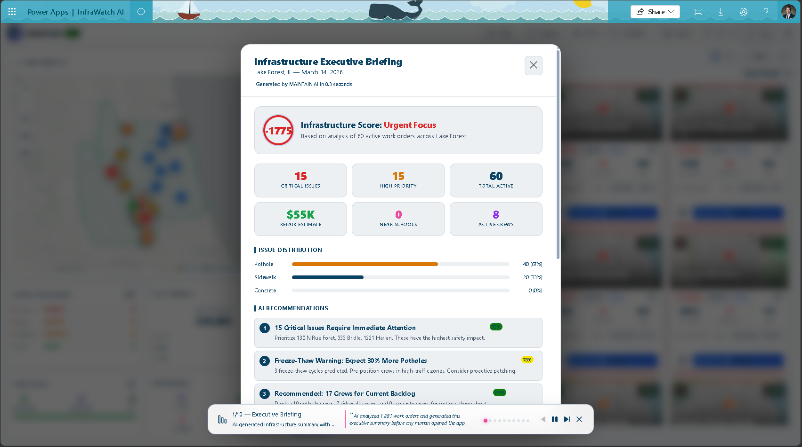
</p>
<p align="center">
  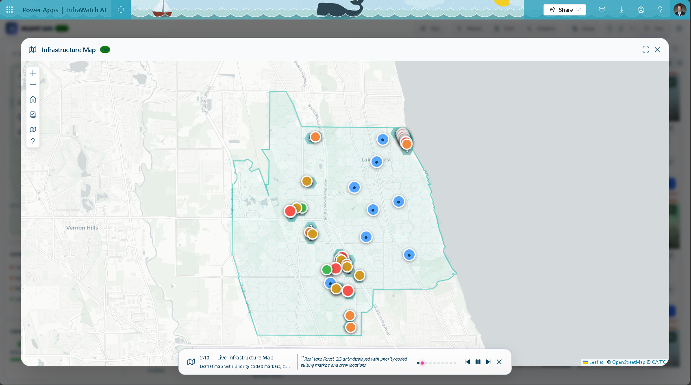
</p>
<p align="center">
  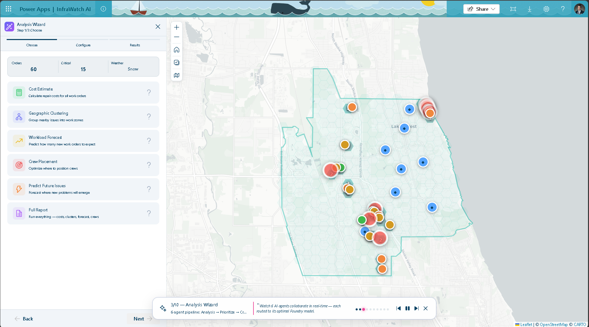
</p>
<p align="center">
  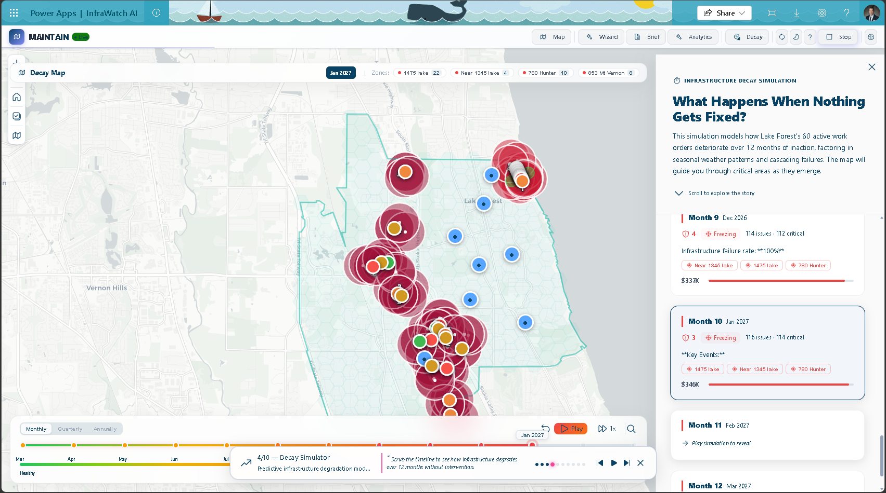
</p>
<p align="center">
  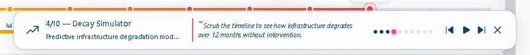
</p>
<p align="center">
  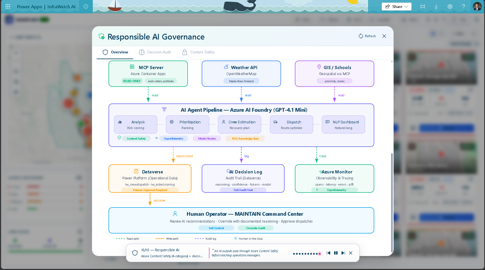
</p>

</details>

### Guided Tour
<details>
<summary>Click to expand (4 images)</summary>

<p align="center">
  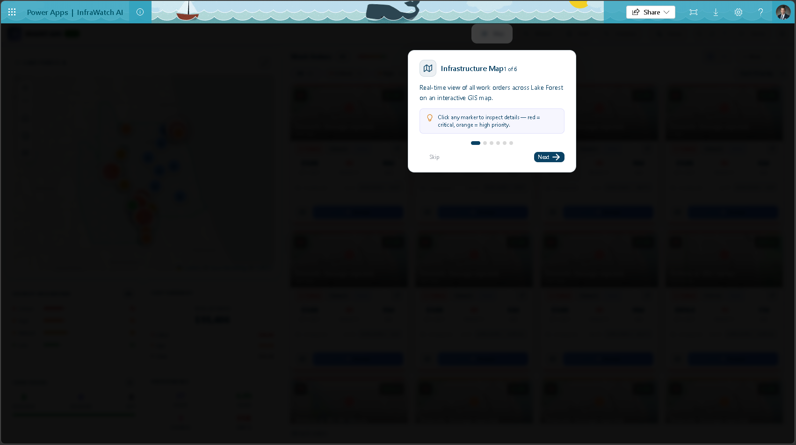
</p>
<p align="center">
  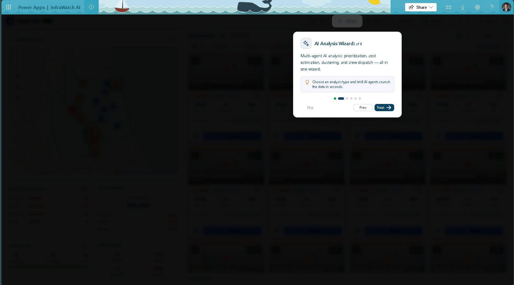
</p>
<p align="center">
  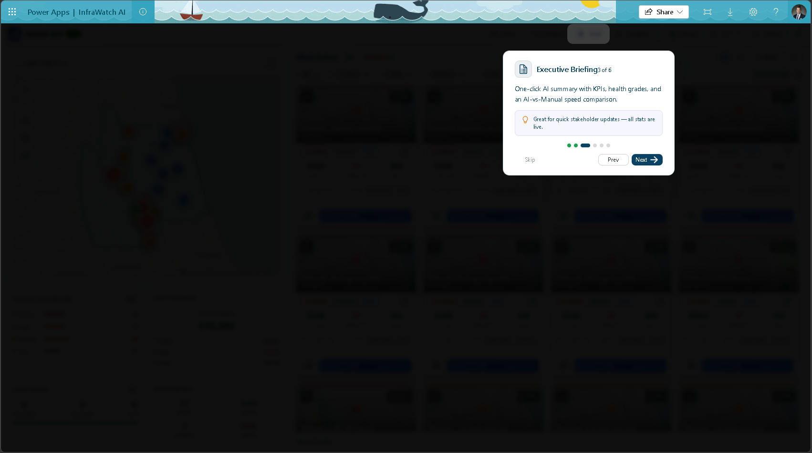
</p>
<p align="center">
  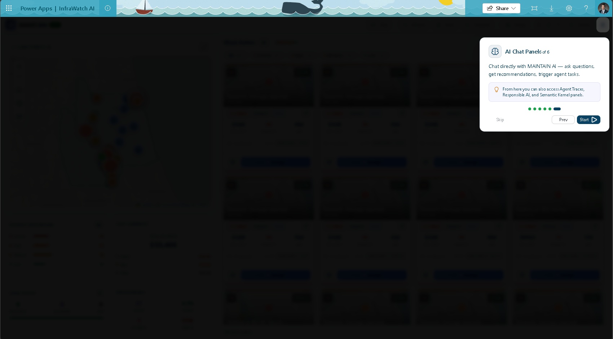
</p>

</details>

### Cost Estimation
<details>
<summary>Click to expand (7 images)</summary>

<p align="center">
  
</p>
<p align="center">
  
</p>
<p align="center">
  
</p>
<p align="center">
  
</p>
<p align="center">
  
</p>
<p align="center">
  
</p>
<p align="center">
  
</p>

</details>

### Crew Placement
<details>
<summary>Click to expand (4 images)</summary>

<p align="center">
  
</p>
<p align="center">
  
</p>
<p align="center">
  
</p>
<p align="center">
  
</p>

</details>

### Geographic Clustering
<details>
<summary>Click to expand (4 images)</summary>

<p align="center">
  
</p>
<p align="center">
  
</p>
<p align="center">
  
</p>
<p align="center">
  
</p>

</details>

### NLP Dashboard Builder (Extended)
<details>
<summary>Click to expand (14 images)</summary>

<p align="center">
  
</p>
<p align="center">
  
</p>
<p align="center">
  
</p>
<p align="center">
  
</p>
<p align="center">
  
</p>
<p align="center">
  
</p>
<p align="center">
  
</p>
<p align="center">
  
</p>
<p align="center">
  
</p>
<p align="center">
  
</p>
<p align="center">
  
</p>
<p align="center">
  
</p>
<p align="center">
  
</p>
<p align="center">
  
</p>

</details>

### Predict Future Issues
<details>
<summary>Click to expand (6 images)</summary>

<p align="center">
  
</p>
<p align="center">
  
</p>
<p align="center">
  
</p>
<p align="center">
  
</p>
<p align="center">
  
</p>
<p align="center">
  
</p>

</details>

### Help Documentation
<details>
<summary>Click to expand (5 images)</summary>

<p align="center">
  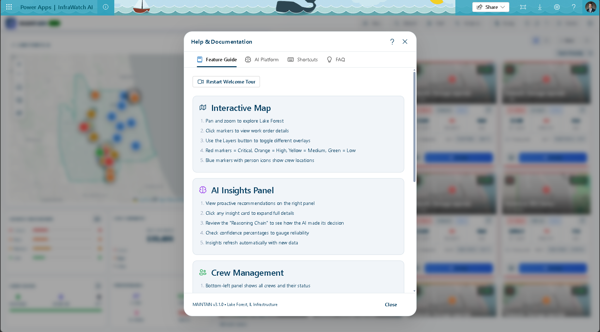
</p>
<p align="center">
  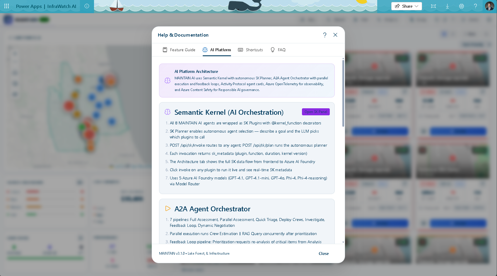
</p>
<p align="center">
  
</p>
<p align="center">
  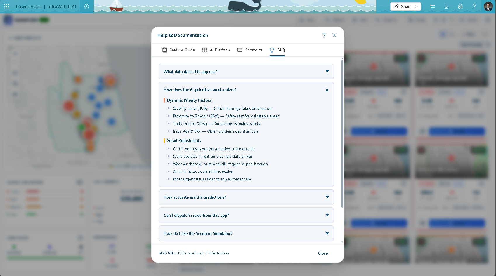
</p>
<p align="center">
  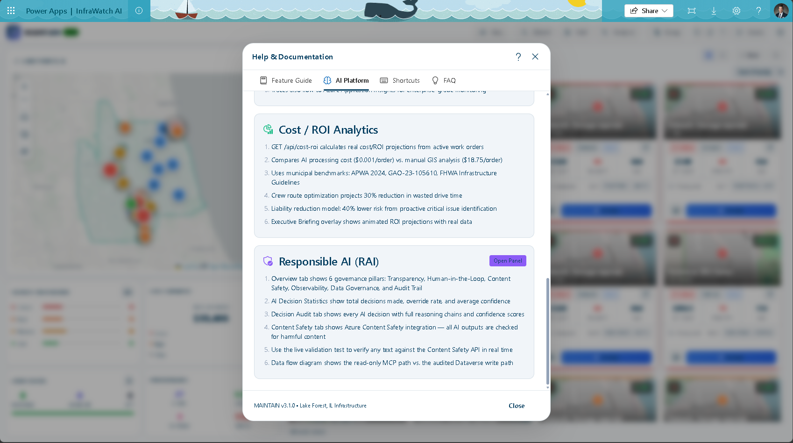
</p>

</details>

### Workload Forecast
<details>
<summary>Click to expand (3 images)</summary>

<p align="center">
  
</p>
<p align="center">
  
</p>
<p align="center">
  
</p>

</details>

---

## �🔗 MAINTAIN AI MCP Server

**Endpoint:** Configured via `INFRAWATCH_MCP_ENDPOINT` environment variable (see `.env.example`)

### Available Tools
| Tool | Description |
|------|-------------|
| `get_work_orders` | Infrastructure work orders from Lake Forest GIS |
| `get_potholes` | 1,281+ pothole records with cost, status |
| `get_sidewalk_issues` | Sidewalk survey with A-F ratings |
| `get_concrete_repairs` | Concrete work orders with dimensions |
| `search_address` | Geocoding for Lake Forest addresses |
| `get_schools` | Elementary school boundaries |
| `calculate_priority_score` | Priority based on severity, location |
| `get_weather_forecast` | Weather for outdoor planning |
| `get_prioritized_work_orders` | Sorted by calculated priority |
| `estimate_repair_cost` | Cost by issue type and severity |

---

## 📊 Crew Estimation Formula

```
Crews Required = Σ(issues × avgRepairTime × severityMultiplier × weatherFactor) / crewCapacityHours

Where:
- avgRepairTime: Historical average per issue type (from WorkOrderHistory)
- severityMultiplier: 1.0 (Low), 1.5 (Medium), 2.0 (High), 3.0 (Critical)
- weatherFactor: 1.0 (Clear), 1.2 (Cold <40°F), 1.5 (Rain), 2.0 (Freeze-thaw)
- crewCapacityHours: 8 hours × crew efficiency rating
```

---

## 📋 Documentation

| Document | Purpose |
|----------|---------|
| [PLAN.md](docs/PLAN.md) | Implementation roadmap & milestones |
| [CHANGELOG.md](docs/CHANGELOG.md) | Version history |
| [ERROR_LOG.md](docs/ERROR_LOG.md) | Error tracking & resolutions |
| [DECISIONS.md](docs/DECISIONS.md) | Architecture Decision Records |
| [AGENT_WORK_LOG.md](docs/AGENT_WORK_LOG.md) | Agent session tracking |

---

## 🤖 GitHub Copilot Usage

GitHub Copilot was integral to building MAINTAIN AI. Here's how it accelerated development:

### Code Generation
- **Component scaffolding**: Copilot generated the initial structure for all 15+ React components (glassmorphism panels, map wrappers, chart components)
- **Model Router**: The multi-model routing architecture with tier-based selection, automatic fallback, and Foundry SDK integration was designed and iterated with Copilot
- **RAG Pipeline**: Knowledge document structuring, TF-IDF vectorization with domain-specific boosting, and cosine similarity retrieval were co-developed with Copilot
- **Service layer**: The MCP service with caching, retry logic, and exponential backoff was developed iteratively with Copilot suggestions
- **Python agents**: Copilot assisted with the Azure SDK integration patterns for `ChatCompletionsClient`, tool-calling loops, and MCP tool function signatures
- **Type definitions**: The full `infrastructure.ts` type system (~30+ interfaces) was co-authored with Copilot

### Problem Solving (Copilot Chat)
- **Foundry SDK migration**: When migrating from `AzureOpenAI` to `azure-ai-inference.ChatCompletionsClient`, Copilot Chat identified the correct SDK patterns, endpoint formats, and model routing architecture
- **CORS mitigation**: Copilot suggested the graceful fallback-to-demo-mode pattern when browser security policies blocked MCP cross-origin requests
- **Leaflet bundling**: Copilot recommended switching from CDN to npm-bundled CSS after tracking prevention blocked the external resource

### Creative Features
- **1,540-line animated brain intro** (`MaintainIntro.tsx`): The neural network SVG animation with lightning arcs was prototyped with Copilot, then refined for performance
- **Pure SVG/CSS charts** (`PredictiveChart.tsx`): Copilot generated the trend line calculation and threshold visualization without any chart library
- **Voice service**: Web Speech API integration with priority-based queue was built with Copilot inline suggestions
- **What-If simulator**: The scenario parameter delta analysis logic was pair-programmed with Copilot

### Documentation & Project Management
- **CHANGELOG.md**: Full changelog with version history, build checkpoint tables, and agent attribution format — structured and maintained with Copilot Chat
- **ERROR_LOG.md**: Error tracking system with root cause analysis, resolution steps, and prevention strategies — Copilot helped design the template and draft entries for all 9 errors (ERR-001 through ERR-009)
- **DECISIONS.md**: Architecture Decision Records (ADR format) with context, alternatives, and consequences — Copilot generated the ADR template and helped articulate trade-offs
- **AGENT_WORK_LOG.md**: Multi-agent session tracking with file locks and handoff protocol — co-authored with Copilot
- **PLAN.md**: Phased implementation roadmap with task tables and checkpoint protocol — structured with Copilot Chat
- **README.md**: Architecture diagrams (ASCII), demo script narrative, tech stack tables, and crew estimation formula — all drafted with Copilot assistance
- **`.github/copilot-instructions.md`**: Custom Copilot instructions for Power SDK workflows — written with Copilot Chat
- **Security remediation**: Copilot Chat identified exposed secrets in tracked files and helped redact credentials, create `.dockerignore`, and replace hardcoded endpoints with environment variables

---

## ✅ Testing & CI

- **252 passing tests** across 9 test files (pytest)
- **GitHub Actions CI** — runs on every push/PR to `main`
  - Python 3.12 test job (pytest with placeholder env vars — no secrets exposed)
  - Node 20 build job (`npm ci && npm run build`)
- Test coverage spans: API endpoints, orchestrator pipelines, model router, Semantic Kernel, content safety, prioritization, crew estimation, dispatch, RAG knowledge base

```bash
# Run tests locally
python -m pytest agents/tests/ --ignore=agents/tests/test_rag_knowledge_base.py -q
# 252 passed in ~4s
```

---

## ♿ Accessibility

- Skip-to-content link for keyboard navigation
- `<main>` landmark with `role="main"`
- All overlays: `role="dialog"`, `aria-modal`, `aria-labelledby`
- `<nav>` for header actions, `<aside>` for AI panel
- `role="toolbar"` on quick actions bar
- `aria-label` on all icon-only buttons, selects, and interactive elements

---

## 👥 Team

Built with ❤️ for the Microsoft AI Dev Days Hackathon 2026

---

## 📄 License

MIT License
