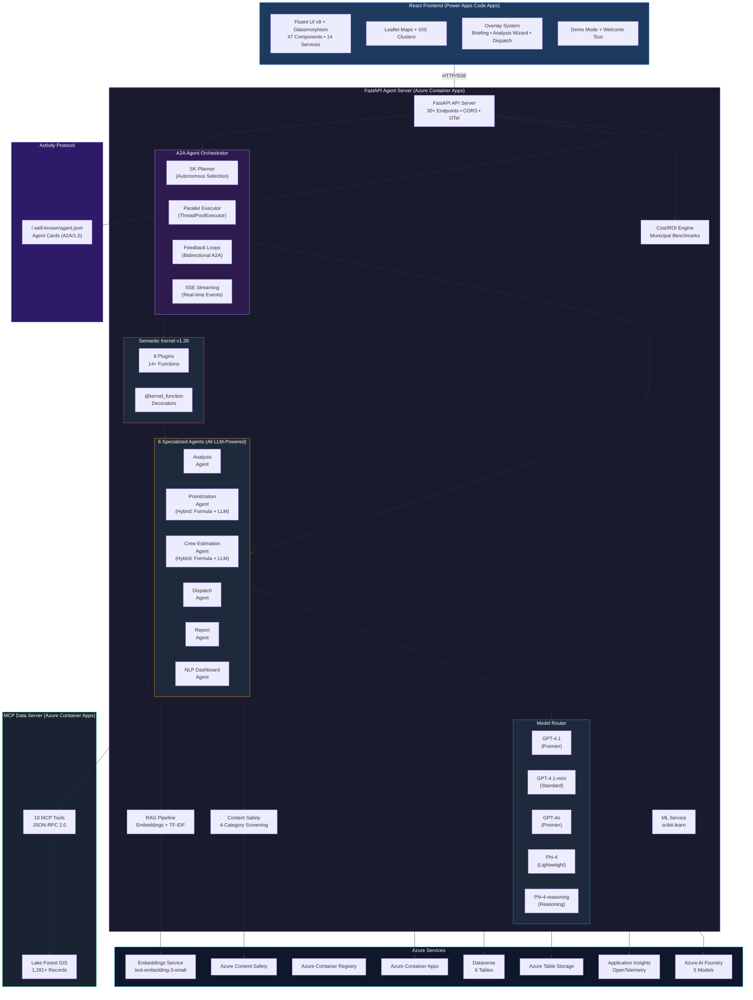

# MAINTAIN AI — System Architecture

> Multi-Agent Predictive Infrastructure Command Center for Lake Forest, IL

## Architecture Diagram

## Component Summary

| Layer | Technology | Details |
|-------|-----------|---------|
| **Frontend** | React 18, TypeScript, Fluent UI v9, Power Apps Code Apps | 47 components, 14 services, Leaflet maps, glassmorphism |
| **Agent Server** | FastAPI, Python 3.12, Azure Container Apps | 30+ endpoints, CORS, OTel distributed tracing |
| **Orchestrator** | A2A Agent-to-Agent Protocol | 7 pipelines (sequential + parallel + feedback + negotiation), SSE streaming |
| **SK Integration** | Semantic Kernel v1.39 | 8 plugins (6 agent + ContentSafety + ML), 14+ functions, autonomous planner |
| **Model Router** | Azure AI Foundry (5 models) | GPT-4.1, GPT-4.1-mini, GPT-4o, Phi-4, Phi-4-reasoning |
| **RAG** | text-embedding-3-small (1536d) + TF-IDF | 12+ curated knowledge documents |
| **Safety** | Azure Content Safety | 4-category screening (Hate, Violence, Self-Harm, Sexual) |
| **Data** | MCP Server (10 tools), Dataverse (6 tables), Table Storage | Lake Forest GIS: 1,281+ real infrastructure records |
| **Observability** | Azure Application Insights, OpenTelemetry | Custom `@traced` decorator, in-memory ring buffer |

## Key Protocols

- **A2A (Agent-to-Agent)**: `/.well-known/agent.json` agent cards, structured handoff messages
- **MCP (Model Context Protocol)**: JSON-RPC 2.0, 10 tools for GIS data retrieval
- **Activity Protocol**: Agent discovery, capability negotiation, streaming events
- **SSE (Server-Sent Events)**: Real-time pipeline execution streaming to frontend
